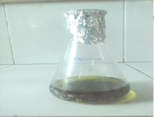
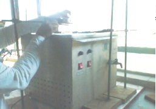
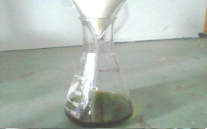
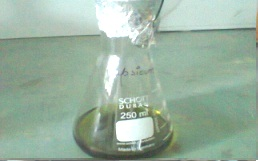
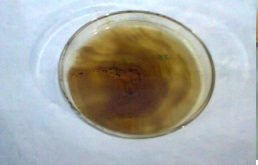
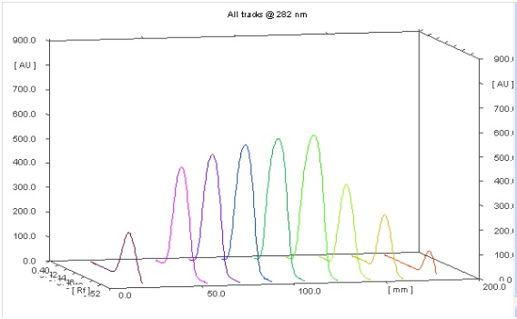
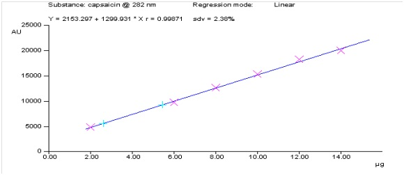
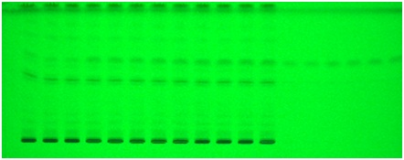

### Procedure

#### (a) Extraction of capsaicin from Red chilli/ Green chilli/ Capsicum

Extraction of oxytocin from different market available vegetables, fruits and milk samples were done by the method of cold percolation with sonication.

<table>
  <tr>
    <td>
      

        Dried Red chili/ Green chili/ Capsicum (4.5 g) + Ethanol (100 ml)
      

    </td>
    <td width="150">
      
    </td>
  </tr>
  <tr>
    <td>
      

        Sonicated for 8 hrs
      

    </td>
    
  </tr>
  <tr>
    <td>
      

        Solvent extract
      

    </td>
    <td width="150">
      
    </td>
  </tr>
  <tr>
    <td>
      

          Filter
      

    </td>
   
  </tr>
  <tr>
    <td>
      

        Filtrate 
      

    </td>
    <td width="150">
      
    </td>
  </tr>
  <tr>
    <td>
      

        Rota vapour (Distillation under reduced pressure)
      

    </td>
    <td width="150">
      
    </td>
  </tr>
  <tr>
    <td>
      

        Crude extracts
      

    </td>
    <td width="150">
      
    </td>
  </tr>
</table>

#### (b) Qualitative and quantitative analysis of capsaicin

- A stock solution of capsaicin was prepared by dissolving capsaicin (5 mg) in methanol (5 ml) in a volumetric flask. The capsaicin samples (extracted from dried Red chili/ Green chili/ Capsicum) were dissolved in ethanol and sonicated for 8 hours.
- The solution was filtered through Whatman No. 41 filter paper and filtrate was used as sample solution.
- The resulting solution was then distilled and distillate was dissolved in methanol.
- A 20cm × 10cm aluminium backed HPTLC plate coated with silica gel
60 F 254 (E. Merck, Darmstadt, Germany) was used for analysis.
- The samples were applied at 10 mm from the base of HPTLC plate by means of a Camag (Switzerland) Linomat V sample applicator using a syringe (100µL, Hamilton, Bonaduz, Switzerland).
- HPTLC analysis was performed on a computerized densitometer scanner 3, controlled by winCATS planar chromatography manager version 1.4.4. (CAMAG, Switzerland)..
- Plate was developed to a distance of 80 mm, in a Camag twin-trough chamber with mobile phase CHCl¬3: MeOH: Acetic acid: 9.5:0.5:0.1 (v/v/v).
- Plates were evaluated by densitometry at 282 nm with a Camag Scanner 3 for quantification.

### Observation

Use of pre-coated silica gel HPTLC plates with Chloroform: Methanol: Acetic acid (9.5:0.5:0.1) (v/v/v) resulted in good separation of the capsaicin at 282 nm (Rf 0.64). The absence of additional peaks in chromatogram indicates non- interference of the common excipients used. Regression analysis of the calibration data for capsaicin showed that the dependent variable (peak area) and the independent variable (concentration) were represented by the equations Y = 2153.297 + 1299.931 x for capsaicin in Red chili, Green chili and Capsicum. The correlation of coefficient (r) obtained was 0.9987 shows a good linear relationship.

    
     
    <b>Fig. 1: 3D View of Scanned Data</b>

 

    
     
    <b>Fig. 2: Linearity of Capsaicin</b>

 

    
     
    <b>Fig. 3: Image at 254 nm</b>

### Results

**Table 1: Quantification of Capsaicin Values in Samples**

| S. No. | Sample Name | Capsaicin Concentration (per 100 g of Chili Extract) |
|:------:|:-----------:|:----------------------------------------------------:|
| 1 | Red Chili | 5.145 g |
| 2 | Green Chili | 0.910 g |
| 3 | Capsicum | 0* |

